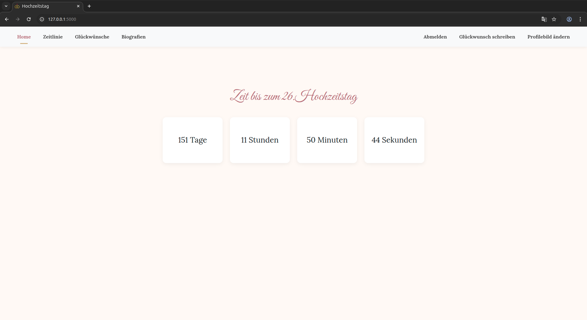
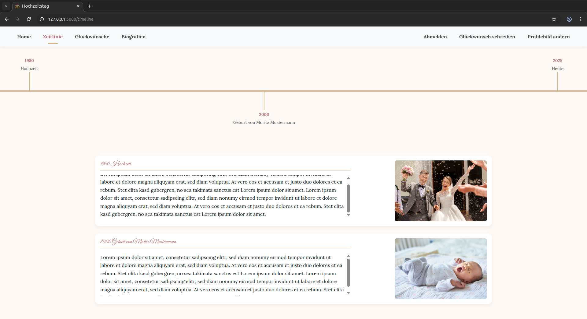
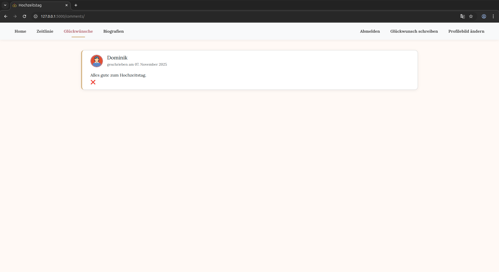
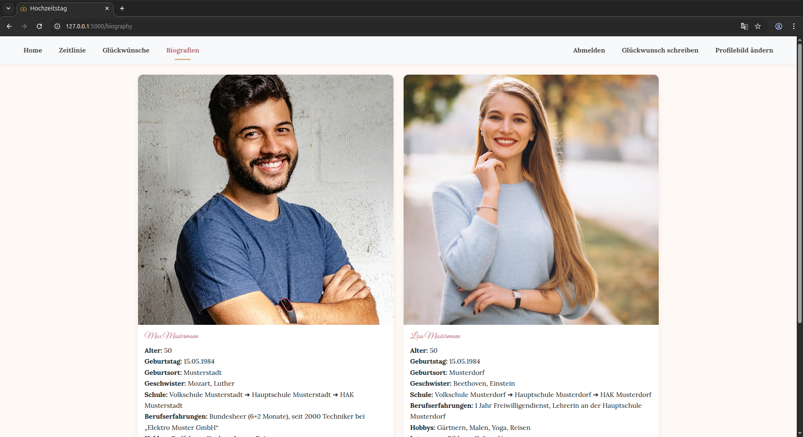
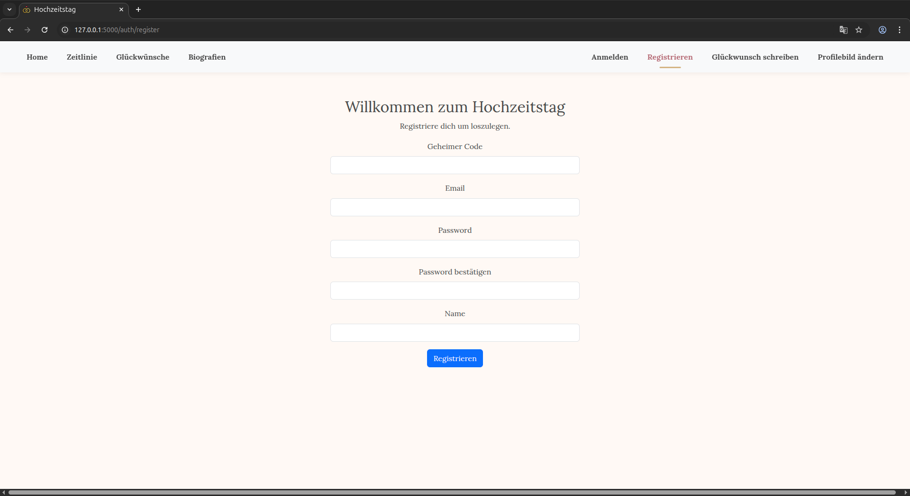
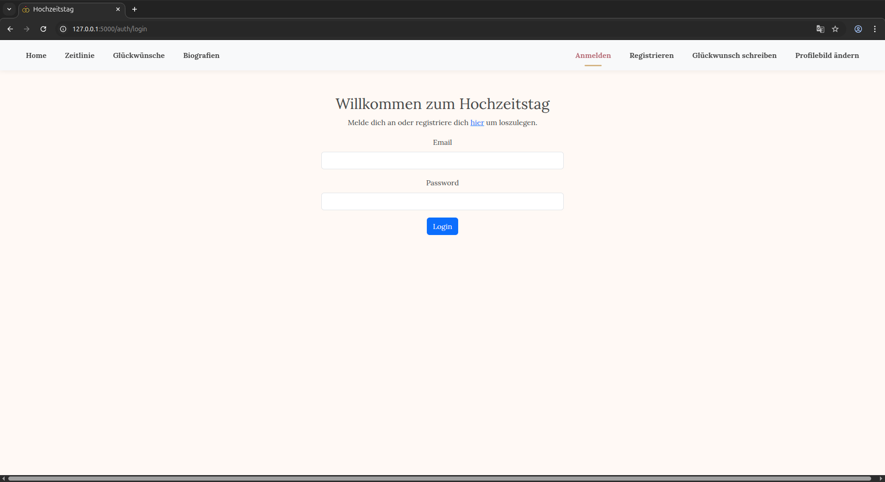
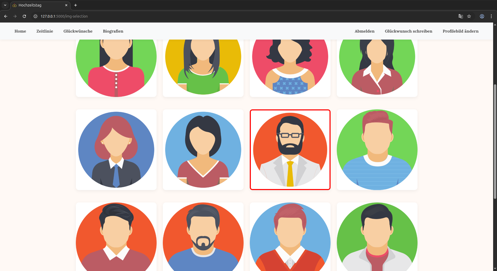
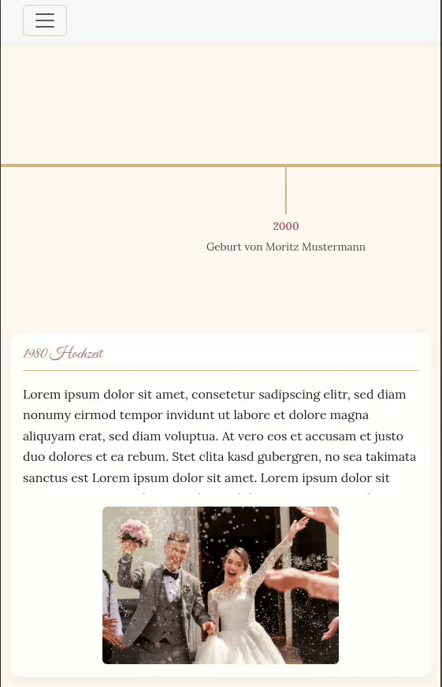

# Wedding-day-website
This is a simple website I created to commemorate my parents 25. Wedding anniversary. It is supposed to show a bit of their life. The website enabels friends and relatives to concratulate them with nice comments.

## Table of Contents
- [Features](#features)
- [Preview](#preview)
- [Technologies](#technologies)
- [Projectstructure](#projectstructure)
- [Installation](#installation)
- [Author](#author)

## Features
- Homepage with countdown until the next wedding anniversary
- Timeline with important life events
- comment page to concratulate the married couple
- biography of both spouses
- registration and login system with a secret key to protect personal information
- 20 profile pictures to choose from
- responsive design for destop and mobil

## Preview
### Homepage

### Timeline

### Comments

### Biography

### Register

### Login

### Profileimage Selection

### Responsive Timeline


## Technologies
- **Python 3.12.3**
- **Flask 3.1.1**
- **Flask-Login**, **Flask-WTF**
- **SQLAlchemy**
- **SQLite** for database
- **Bootstrap5**, **Jinja2**
- **Werkzeug**

## Installation

### Clone Repository
```bash
git clone git@github.com:TabitoSaito/Wedding-day-website.git
cd Wedding-day-website
```

### Set Virtual Enviroment
```bash
python -m venv venv
source venv/bin/activate # (Windos: venv\Scripts\activate)
```
### Install Requiremantes
```bash
pip install -r requirements.txt
```
### Run Application
```bash
flask run
```
website can be reached with [http://127.0.0.1:5000/]()

## Author
**Dominik Hölzl**</br>
[GitHub-Profil](https://github.com/TabitoSaito)
